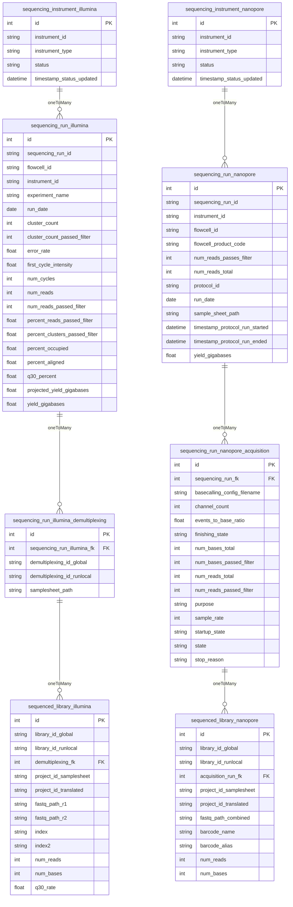

# sequencing-runs-db

Note: In the diagram below, `id` is used as the primary key field. But in the real database schema, that field is named `pk`. `id` is used in the diagram because using `pk` causes a rendering errror.

