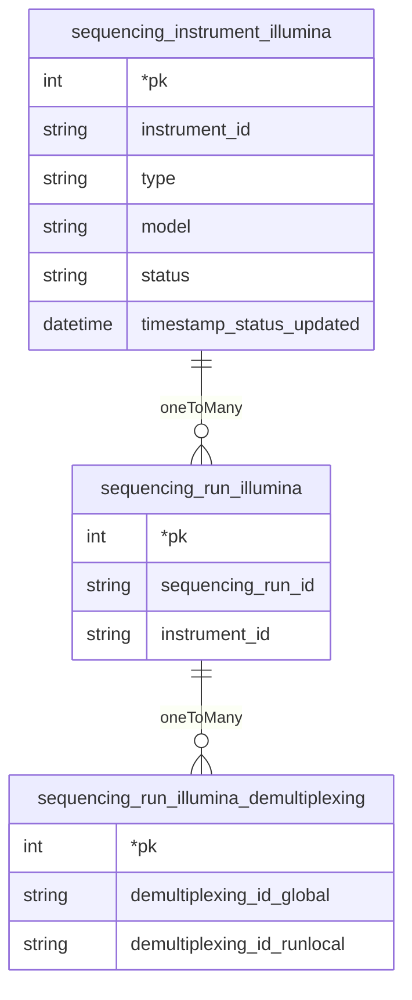

# sequencing-runs-db

```mermaid
erDiagram
  sequencing_instrument_illumina {
    int *pk
    string instrument_id
    string type
    string model
    string status
    datetime timestamp_status_updated
  }
  sequencing_run_illumina {
    int *pk
    string sequencing_run_id
    string instrument_id
  }
  sequencing_instrument_illumina ||--o{ sequencing_run_illumina : oneToMany
  sequencing_run_illumina_demultiplexing {
    int *pk
    string demultiplexing_id_global
    string demultiplexing_id_runlocal
  }
  sequencing_run_illumina ||--o{ sequencing_run_illumina_demultiplexing : oneToMany
```
